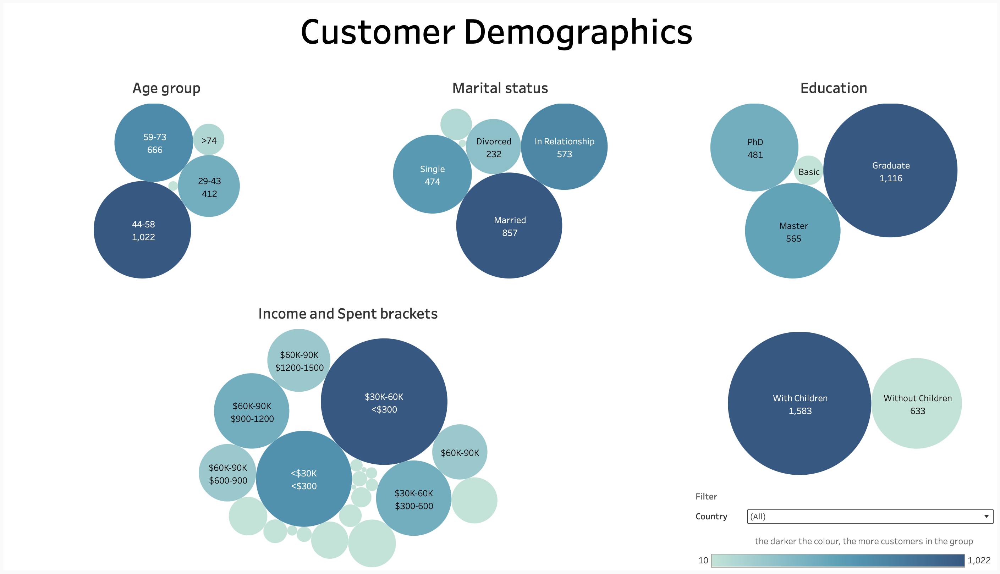
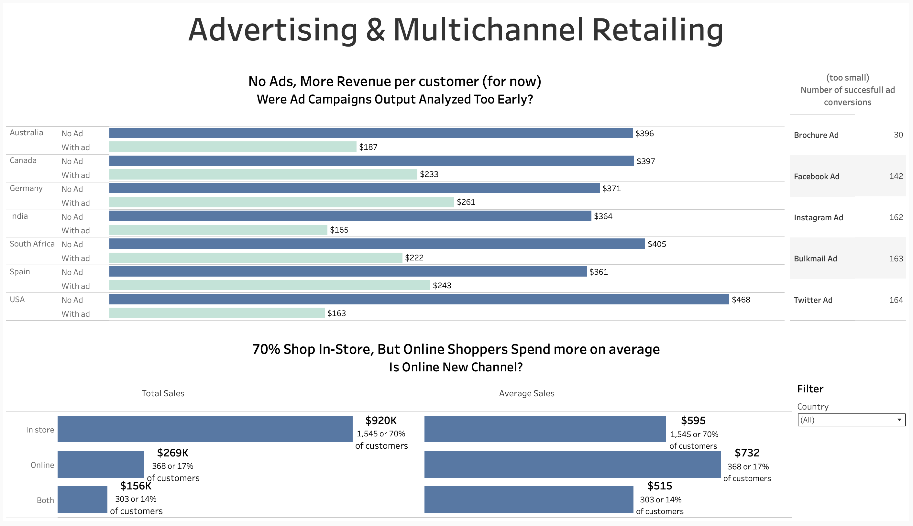
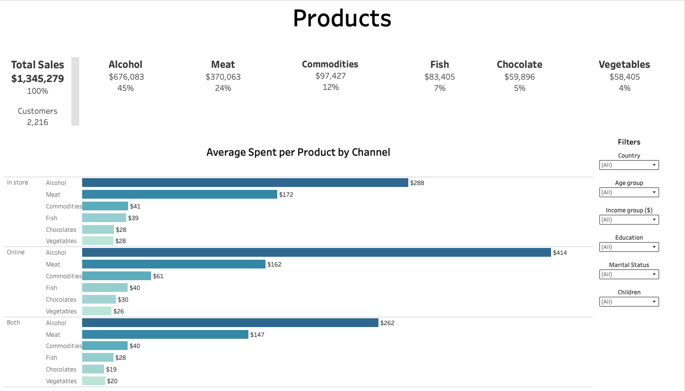

# 🛒 2Market Project - part of LSE Data Analytics course

**Tools used**: Excel, SQL, Tableau

📂 [Technical Report](Cepure_Jurgita_.pdf)
📂 [Presentation Slides](2Market_Presentation.pdf)

----------------------

## ❓ Business Questions: 

A fictional global supermarket which sells products online and in-store needs help to understand their customer purchase behaviour:

- The demographics of their customers 
- Which advertising channels seem to be the most effective
- Which products seem to sell the best and if that varies based on demographic

----------------------

## 🎯 Key Focus Areas:
1. Customer demographic analysis:
- What are the key demographic attributes (e.g., age, education, marital
status, children, income, location) of the customer base?
- Are there any noticeable patterns or preferences among different
demographic groups?
- How do customer demographics differ between online and in-store
shopping?
2. Advertising channel effectiveness:
- Which advertising channels are most effective at driving sales both
online and in-store?
- Which advertising channels are most effective at driving sales per
country?
3. Top-selling products and customer segmentation
- What are the top-selling products across different customer segments?
- Are there any products that perform better with certain demographics or
in certain geographic areas?
- How do customer preferences differ across product categories?
- Are there any under-performing products or categories that may need
rebranding or discontinuation?
- Are there any missing product groups (e.g. dairy)
4. Considering the dual nature of 2Market's operations, understanding the split
between online and in-store business performance is essential. Insights from
this analysis can drive decisions related to resource allocation, supply chain
optimization, and inventory management.
- What is the revenue split between online and in-store sales?
- Are there different product preferences between online shoppers and in-
store shoppers?
- How does customer behaviour (average spend etc) differ across these
two channels?

----------------------

## 🫚 Data Source
The primary data source - *Marketing_data* file, which provided the most detailed information, while the *Ad_data* file was left-joined into it using the primary key column, *id*.

----------------------

## ⚙️ Analytical Approach 

**Cleaned and pre-processed the data** by fixing inconsistencies, handling outliers, correcting data types, and improving database interactions to ensure completeness and reliability.

**SQL Analysis** on spending by country, product popularity by demographics, and ad platform performance, uncovering key patterns to support better decisions.

**Created Dashboards** focused on answering a specific aforementioned business question.

**Identified patterns and trends** followed by actionable **insights and recommendations**.

----------------------

## 📊 Patterns, Trends, and Insights

The dataset was heavily skewed towards Spain, which accounted for 49% of all customers, with South Africa and Canada contributing 15% and 12%, respectively. This could be due to factors such as data collection methods, business strategy, or market characteristics, and warrants further investigation.

**Customer Dashboard**

Key **customer** patterns reveal that the majority are in the 44-58 age group, married or in a relationship, with children, and hold a degree or higher. Most prefer in-store shopping, earn approximately $50K annually, and spend on average under $300. The latter may derive from pattern where it was found that people with children tend to be more cautious with spending. These insights are consistent across countries.

**Advertising Dashboard**

Regarding **advertising effectiveness**, the data is insufficient to definitively measure the impact of specific marketing channels also duration of campaigns is unknown. That may have had an impact too. However, the analysis suggests that customers who were not targeted by ads tend to spend more on average, whether shopping online or in-store.

**Product Dashboard**

On the **product**, limiting factor was the absence of unit sales and pricing data. Nonetheless, alcoholic beverages emerged as the top-selling category based on total and average sales, followed by meat. Other product categories contributed significantly less. This trend held across most demographics and countries. Notably, dairy products were excluded from the dataset, which may have skewed product distribution analysis.

----------------------

## 💊 Conclusions and Next Steps

Due to current data gaps, it’s too early to draw firm conclusions. Further analysis is recommended after addressing the following:

- Expand and balance customer samples across countries.
- Collect data linking product prices to sales volumes.
- Refine ad campaigns to better capture relevant data.
- Include missing product categories (e.g., dairy) for a fuller view.
----------------------
